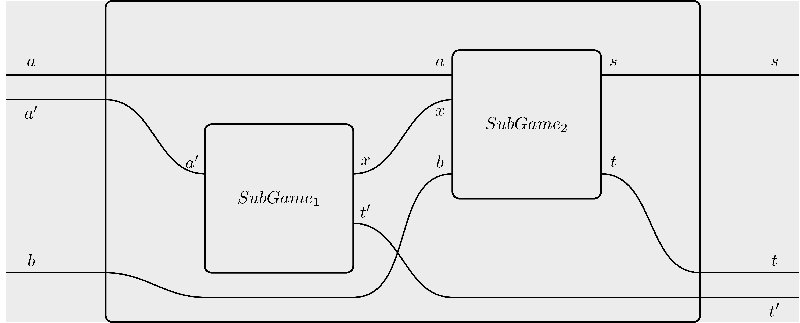

# Table of contents
- [Summary](#summary)
    - [Analytics results](#analytics-results)
- [Installation](#installation)
    - [Normal execution](#normal-execution)
    - [Interactive execution](#interactive-execution)
    - [Addendum: Installing haskell](#addendum-installing-haskell)
- [Explaining the model](#explaining-the-model)
    - [Recap: credible commitments](#recap-credible-commitments)
    - [Vanilla prisoner's dilemma](#vanilla-prisoners-dilemma)
    - [Prisoner's dilemma with a commitment device](#prisoners-dilemma-with-a-commitment-device)
    - [Prisoner's dilemma with branching](#prisoners-dilemma-with-branching)
    - [Prisoner's dilemma with extortion](#prisoners-dilemma-with-extortion)
    - [Prisoner's dilemma with customizable extortion](#prisoners-dilemma-with-customizable-extortion)
    - [Prisoner's dilemma with a coordinator](#prisoners-dilemma-with-a-coordinator)
    - [Assumptions made explicit](#assumptions-made-explicit)
    - [The AMM game](#the-amm-game)
    - [The AMM game with private information](#the-amm-game-with-private-information)
- [Code deep dive](#code-deep-dive)
    - [Recap: DSL primer](#recap-dsl-primer)
        - [The building blocks](#the-building-blocks)
        - [exogenous parameters](#exogenous-parameters)
        - [Basic operations](#basic-operations)
        - [Branching](#branching)
        - [Supplying strategies](#supplying-strategies)
            - [Evaluating strategies](#evaluating-strategies)
            - [Stochasticity](#stochasticity)
            - [Branching](#branching-1)
        - [Stochasticity](#stochasticity)
    - [File structure](#file-structure)
- [Analytics](#analytics)
    - [Reading the analytics](#reading-the-analytics)
    - [Strategies emplyed in the analysis](#strategies-employed-in-the-analysis)
        - [Vanilla prisoner's dilemma](#vanilla-prisoners-dilemma-1)
        - [Prisoner's dilemma with a commitment device](#prisoners-dilemma-with-a-commitment-device-1)
        - [Prisoner's dilemma with branching](#prisoners-dilemma-with-branching-1)
        - [Prisoner's dilemma with extortion](#prisoners-dilemma-with-extortion-1)
        - [Prisoner's dilemma with customizable extortion](#prisoners-dilemma-with-customizable-extortion-1)
        - [Prisoner's dilemma with a coordinator](#prisoners-dilemma-with-a-coordinator-1)
        - [The AMM game](#the-amm-game-1)
        - [The AMM game with private information](#the-amm-game-with-private-information-1)
    - [Running the analytics](#running-the-analytics)
    - [Results](#results)
    - [Sanity checks](#sanity-checks)
# Summary

In this FRP we focused on modelling some of the thought experiments around prisoner's dilemma with credible commitments as detailed in [Xin's research](https://docs.google.com/presentation/d/1on6OpmjEuFQ5HQOx6b6JjWzUHZx5pBoWbxVJyKAFS_c/edit#slide=id.p). We then generalized these experiments to a more tangible case involving frontrunning and swaps in an *automatic market maker (AMM)*.

## Analytics results

We verified that everything that was supposed to be an equilibrium is indeed an equilibrium:

- In [Vanilla prisoner's dilemma](#vanilla-prisoners-dilemma), the equilbrium is `(Defect, Defect)`;
- In [Prisoner's dilemma with a commitment device](#prisoners-dilemma-with-a-commitment-device), the equilibrium is `(Cooperate, Cooperate)`;
- In [Prisoner's dilemma with branching](#prisoners-dilemma-with-branching), the equilibrium is choosing to play the commitment device version, and then `(Cooperate, Cooperate)`;
- In [Prisoner's dilemma with extortion](#prisoners-dilemma-with-extortion), the equilibrium is again `(Cooperate, Cooperate)`, but the payoffs are obviousl skewed against the extorted player. As we expected, the equilibrium breaks when the extorted value makes the extorted player's payoff lower than the one it would have been by playing `Defect`.
- In [Prisoner's dilemma with a coordinator](#prisoners-dilemma-with-a-coordinator), we verified that the equilibrium for both players consists in trying to outbid each other to win the right to commit (frontrunning).

Essentially, everything worked as expected, and we can say with certainty that the game-theoretic research we were tasked to model is formally sound.

As for [The AMM game](#the-amm-game), 
- We verified that with a greedy coordinator users have an incentive to pay fees to frontrun each other. We also found some optimal fees.
- We verified that with a coordinator working to maximize global welfare trying to bribe the coordinator does not make sense, and that the coordinator will reorder the AMM transactions to reduce global slippage.
- We verified that in the presence of players' private information, as in [The AMM with private information](#the-amm-game-with-private-information) game, the old equilibrium for the welfare-maximizing coordinator breaks down.


# Installation

To run the model, it is necessary to have `haskell` and `stack` installed on your machine. Refer to the subsection [Addendum: Installing haskell](#addendum-installing-haskell) for instructions. A deeper dive into the code structure can be found in the [Code deep dive](#code-deep-dive) subsection.

There are two main ways of running the model: normal and interactive execution.

## Normal execution

To 'just' run the model, type

```sh
stack run
```
in the main directory, where the file `stack.yaml` is located.
The model will be compiled and a predefined set of analytics will be run. The results of the predefined analytics will be shown on terminal.

## Interactive execution

One of the most powerful features of `haskell` is *REPL mode*. This allows you to recompile the code on the fly, to query the type of a function and a lot of other things. To start interactive mode, just run

```sh
stack ghci
```

in the main directory. The code will compile, and then an interactive terminal (REPL) window will open. There are various commands that can be fed to the REPL. Among the most useful ones we highlight:

| Command         | Description               |
|:----------------|--------------------------:|
| `:q`            | quit interactive mode     |
| `:r`            | recompile the source code |
| `:l module`     | load module               |
| `:t expression` | query expression type     |

Of these commands, `:t` is the most important one, as it allows to visualize clearly what type of input we must feed to a given function. For instance, `:t (&&)` produces the output:

```haskell
(&&) :: Bool -> Bool -> Bool
```
Which tells us that `(&&)` - the logical `and` operator - takes a boolean (a truth value), then another boolean, and returns a boolean (the logical `and` of the first two).

Since under the hood games are nothing more than functions, REPL allows us to see the game type by doing `:t gameName`. If the game is parametrized, say, over a string, then `:t gameName "string"` will return the type where the first component has already been filled.

This tool is expecially powerful to better understand the structure of the strategies we have to feed to the model, which can grow very complicated as the model scales.

## Addendum: Installing haskell
If you dont' have either `haskell` or `stack`, it is necessary to install them. there are many ways to do so; on Linux/macOS systems, we suggest using [ghcup](https://www.haskell.org/ghcup/).
In a terminal, type:

```sh
 curl --proto '=https' --tlsv1.2 -sSf https://get-ghcup.haskell.org | sh 
```

If asked, respond 'yes' (`Y`) to the following questions:

```
Do you want to install haskell-language-server (HLS)?
Do you want to enable better integration of stack with GHCup?
```

Afterwards, `ghcup` may ask you to install some additional packages before continuing with the installation. Follow the advice before continuing. Then, just follow the instructions through the end.

`ghcup` is a very convenient solution in that it installs only in one folder (on Linux systems, `/home/$USER/.ghcup`). Should you decide to get rid of `haskell` altogether, just delete the folder.

**A note of warning:** GHC, the `haskell` compiler installed with `ghcup`, relies heavily on the GCC compiler. GHC assumes that GCC comes together with all the relevant libraries. As such, in compiling the model you may get errors such as:

```sh
/usr/bin/ld.gold: error: cannot find -ltinfo
```
these errors hint at missing GCC libraries, which will have to be installed independently. The precise iter to do so depends on the libraries involved and on your operating system. Unfortunately there is little we can do about it, as this is a problem with the general `haskell` developer infrastructure.


# Explaining the model

Here, we give a more detailed explanation of what our model does.

## Recap: credible commitments
Our model is based on Xin's research on [credible commitments](https://docs.google.com/presentation/d/1on6OpmjEuFQ5HQOx6b6JjWzUHZx5pBoWbxVJyKAFS_c/edit#slide=id.p). The model comprises a bunch of different games, each one being expanded into the next one:


### Vanilla prisoner's dilemma

First of all, we implemented a very basic [prisoner's dilemma](https://en.wikipedia.org/wiki/Prisoner%27s_dilemma): There are two players, **Alice** and **Bob**, each one having to choose between `Cooperate` and `Defect`. Their choices get submitted to a payoff matrix structured so that the pair `(Defect, Defect)` is the only possible [Nash equilibrium](https://en.wikipedia.org/wiki/Nash_equilibrium). This is a straightforward implementation of a very famous game, and we won't dwell further on it.


### Prisoner's dilemma with a commitment device

The next game is prisoner's dilemma with a *commitment device*: Essentially, this is a version of prisoner's dilemma where **Alice**'s strategic choice is replaced by an [exogenous](#exogenous-parameters) function, which we call `commitment`. The idea is simple: **Alice**'s strategy now consists in supplying a commitment which announces beforehand how she intends to respond to **Bob**'s choice. In the case we are most interested in, **Alice**'s strategy consists in supplying a function which will result in `Cooperate` if **Bob**'s choice is `Cooperate`, and `Defect` if **Bob**'s choice is **Defect**. We expect that in this scenarios the Nash equilibrium shifts towards **Bob** playing `Cooperate`.


### Prisoner's dilemma with branching

We then merged [Vanilla prisoner's dilemma](#vanilla-prisoners-dilemma) and [Prisoner's dilemma with a commitment device](#prisoners-dilemma-with-a-commitment-device) into a [branching game](#branching): Here, **Alice** can first choose if she wants to play vanilla prisoner's dilemma or prisoner's dilemma with commitment. Both **Alice** and **Bob** need to supply strategies for each of the two possible [branchings](#branching-1). We expect that the Nash equilibrium strategies are to play the version with the commitment device, and then cooperate.


### Prisoner's dilemma with extortion

Afterwards, we generalized the situation further into a game where the commitment device is turned into an *extortion device*. The game works as the  prisoner's dilemma with commitment, with the difference that now **Alice**, in order to play **Cooperate** which would result into a better outcome for **Bob**, also requires the payment of a bribe. So **Bob** must now choose between cooperating and being extorted, or defecting.
As before, we combine the extortion game with a traditional prisoner's dilemma game using branching. Here, we expect that the Nash equilibrium consists in **Alice** choosing to use the extortion device, and **Bob** paying the bribe up to some value, beyond which choosing to play `Defect` results into a profitable deviation.

### Prisoner's dilemma with customizable extortion

We implemented this variation on a separate branch, called `alice-strategic-extortion`. Here, **Alice** can strategically set the value of the extortion. **Bob**, in turn, can see both the extortion value and the payoff matrix, and determine if it is more convenient for him to cooperate (and get extorted) or just defect. We expect the equilibrium being **Alice** extorting exactly enough so that there is no difference for **Bob** to Cooperate or Defect. 

### Prisoner's dilemma with a coordinator

To conclude our iterations over prisoner's dilemma, we implemented a version with **Coordinator**. This game is like in the previous point, with the difference that the roles of **Alice** and **Bob** are not anymore fixed in advance. There is a third player, called **Coordinator**, who decides which player between **Alice** and **Bob** gets to use the commitment device. Both players can pay **Coordinator** a bribe in order to get picked for this task. Coordinator just wants to maximize the amount of money it receives. As being able to set the commitment device results in a strategic advantage (the player committing gets the power to extort money from the other one), we expect that the best strategy for both **Alice** and **Bob** consists in trying to outbid each other (frontrunning).

These simple games model quite well the stages through which one goes from vanilla non-cooperative games to full flagged MEV: The presence of a commitment device first results in a more positive outcome, as it makes Nash equilibrium and the social welfare optimum coincide. Afterwards, the commitment device can be weaponized into an exploitative device. Finally, in the last game, we see how in the presence of the **Coordinator** familiar MEV strategies such as *frontrunning* arise naturally. So, paradoxically we are back to square one, as the last games produces outcomes for the players akin to the ones they began with.


## The AMM game

As a next step, we wanted to implement the previous considerations into a more 'real-life' model. Moreover, we wanted to explore first-hand notions of *price of anarchy*, which can be loosely defined as 'the price premium paid for the lack of organization'.

To model this, we imagined the following situation: There is an automatic market maker and **Alice** and **Bob** want to use it to swap funds in the same direction (say, token1 for token2). Moreover, **Coordinator** receives the transactions from both players and can reorder them at will. We came up with two different scenarios:
- In the first one, **Coordinator** just wants to maximize its payoff. In this setup the player that gets in the block first benefits the most, as the next transaction will be impacted by the price slippage caused by the first. This game is in essence very similar to [Prisoner's dilemma with a coordinator](#prisoners-dilemma-with-a-coordinator): Both **Alice** and **Bob** have an interest in frontrunning each other.
- In the second scenario, we set **Coordinator**'s payoff to simply be the sum of **Alice** and **Bob**'s payoffs, with any fee ignored. So in this case **Coordinator** is completely 'selfless' and benefits the most when the players benefit the most. We verify that the equilibrium strategy for **Coordinator** is just rearranging transactions so to counter slippage as much as possible. In this case, it does not make any sense to pay a fee since this would decrease **Alice** and **Bob**'s payoffs and not increase the **Coordinator's** payoff.

    This latter scenario exemplifies well the idea of *price of anarchy*: Leaving the transaction order as they are results in a much poorer outcome for all players if this is compared with the outcome resulting from the optimal ordering. This difference is what we indeed call the 'price of anarchy'.


## The AMM game with private information

We implemented this variation on a separate branch, called `private-information`. In the previous AMM game, transactions submitted by the players had no *intrinsic utility*. Players were forced to submit their transactions, and the incentive in frontrunning other players came only from the fact that a better slippage would result in a smaller loss.

In this variation of the game, we endow players with *private information*: Namely, a number of type`Double` expressing how important it is for the player that their transaction is first in the block. This value is added to the players' payoffs if and only they get included first. This represents, indeed, the added utility coming from successful frontrunning.

The players are considered to be *uncorrelated*. This means that players' private values are independent of each other.


## Assumptions made explicit
Regarding the variations over prisoner's dilemma, thanks to the high quality of the original research we started from, we were able to implement things 'as is', without having to make anything more explicit than it already was.

For the AMM case, we had to be a bit more careful: In particular, we assumed that the fee a player pays to **Coordinator** is taken irrespective of the outcome of the transaction: That is, even if the transaction reverts, the fee is paid anyway. As usual, we model **Alice** and **Bob** as rational, just willing to maximize their payoff. To take slippage into account, we passed a 'real' `exchangeRate` as an [exogenous parameter](#exogenous-parameters): This represents the 'real world' conversion rate between the couple of tokens we consider. In the beginning, the AMM is initialized so that the tokens in the pool reflect this rate. As things progress, the rate given in the AMM *slips* from the real world one.

Furthermore, we fixed the transaction type for both **Alice** and **Bob**. This means that both players are forced to make a very precise swap, and have agency only on how much fees they want to pay.

As for the AMM architecture itself, we resorted to a very simple [constant function AMM](https://en.wikipedia.org/wiki/Constant_function_market_maker).


# Code deep dive

## Recap: DSL primer

Our models are written in a custom DSL compiled to `haskell`. Here we give a brief description of how our software works.

### The building blocks
The basic building block of our model is called **open game**, and can be thought of as a game-theoretic lego brick. This may represent a player, a nature draw, a payoff matrix or a complex combination of these elements. It has the following form:

```haskell
gameName variables = [opengame|

   inputs    : a;
   feedback  : b;

   :----------------------------:

   inputs    : a';
   feedback  : b';
   operation : content;
   outputs   : s';
   returns   : t';

   :----------------------------:

   outputs   :  s;
   returns   :  t;
  |]
```

We can imagine this block as a box with 4 wires on its outside, on which travels information marked as:
- `inputs`, data that gets fed into the game (e.g. a player receiving information from a context).
- `outputs`, data that the game feeds to the outside world (e.g. a player communicating a choice to another player).
- `returns`, the returns of a player actions, which are usually directly fed to a function calculating payoffs.
- The `feedback` wire which sends information back in time. If, intuitively, `returns` represents the returns on a player action, one could imagine it as 'information that an agents receive from the future'. `feedback` is the dual analog of that: If a given piece of information comes from the future, someone in the future must have been sent it to the past. For additional details about the `feedback` wire please refer to the relevant [literature](https://arxiv.org/abs/1603.04641).

The `:--:` delimiters separate the outside from the inside of the box. As one can see, the interfaces inside are replicated. This is intentional as it allows for a notion of *nesting*. For instance, the situation depicted in the following picture:



Can be represented by the following code block:

```haskell
gameName variables = [opengame|

   inputs    : a, a';
   feedback  : b;

   :----------------------------:

   inputs    : a';
   feedback  : ;
   operation : SubGame1;
   outputs   : x;
   returns   : t';

   inputs    : a, x;
   feedback  : b;
   operation : SubGame2;
   outputs   : s;
   returns   : t;
   :----------------------------:

   outputs   :  s;
   returns   :  t,t';
  |]
```

In turn, `Subgame1` and `Subgame2` can be other games defined using the same DSL. Notice that the wire `x` is internal and totally hidden from the 'outside world'. 

### exogenous parameters

An exogenous parameter is a given assumption that is not part of the model, and is fed to it externally. As such, it is treated by the model as a 'fact' that cannot really be modified. An example of exogenous parameter could be the market conditions at the time when a game is played.

exogenous parameters are just defined as variables, as the field `variables` in the previous code blocks testifes. These variables can in turn be fed as exogenous parameters to inside games, as in the following example:

```haskell
gameName stock1Price stock2Price  = [opengame|

   inputs    : a, a';
   feedback  : b;

   :----------------------------:

   inputs    : a';
   feedback  : ;
   operation : SubGame1 stock1Price;
   outputs   : x;
   returns   : t';

   inputs    : a, x;
   feedback  : b;
   operation : SubGame2 stock2Price;
   outputs   : s;
   returns   : t;
   :----------------------------:

   outputs   :  s;
   returns   :  t,t';
  |]
```

### Basic operations

In addition to the DSL defining the 'piping rules' between boxes, we provide some *basic operations* to populate a box, namely:
- A *function*, which just transforms the input in some output.
- A *stochastic distribution*, used to implement draws from nature.
- A *strategic choice*, which can be thought of as a function parametrized over strategies.

### Branching

Another important operation we provide is called *branching*. This is useful in contexts where, say, a player choice determines which subgame is going to be played next.
Branching is represented using the operator `+++`. So, for instance, if `SubGame1` is defined as ```branch1 +++ branch2```, then we are modelling a situation where `SubGame1` can actually evolve into two different games depending on input. As the input of a game can be the outcome of a strategic choice in some other game, this allows for flexible modelling of complex situations.

Graphically, branching can be represented by resorting to [sheet diagrams](https://arxiv.org/abs/2010.13361), but as they are quite complicated to draw, this depiction is rarely used in practice.


### Supplying strategies

As usual in classical game theory, a strategy conditions on the observables and assigns a (possibly randomized) action. 

Every player who can make a decision in the game needs to be assigned a strategy. These individual strategies then get aggregated into a list representing the complete strategy for the whole game.

So, for instance, if our model consists of three subgames, a strategy for the whole model will just be a list:

```haskell
strGame1 ::- strGame2 ::- strGame3 ::- Nil
```

#### Evaluating strategies

To evaluate strategies, it is enough to just run the `main` function defined in `Main.hs`. This is precisely what happens when we give the command `stack run`. In turn, `main` invokes functions defined in `Analysis.hs` which define the right notion of equilibrium to check. If you want to change strategies on the fly, just open a REPL (Cf. [Interactive Execution](#interactive-execution)) and give the command `main`.
You can make parametric changes or even define new strategies and/or notions of equilibrium by editing the relevant files (cf. [File structure](#file-structure)). Once you save your edits, giving `:r` will recompile the code on the fly. Calling `main` again will evaluate the changes.


#### Stochasticity

Our models are Bayesian by default, meaning that they allow for reasoning in probabilitic terms.

Practically, this is obtained by relying on the [Haskell Stochastic Package](https://hackage.haskell.org/package/stochastic), which employs monadic techniques.

A consequence of this is that deterministic strategic decisions (e.g. 'player chooses option A') must be lifted into the stochastic monad, getting thus transformed into their probabilistic equivalent (e.g. 'of all the options available, player chooses A with probability 1')

A practical example of this is the following:

```haskell
strategyName
  :: Kleisli
       Stochastic
       (Parameter1, Parameter2)
       Decision
strategyName = pureAction Decision1
```

In the example above, the player observes some parameters (`Parameter1` and `Parameter2` in this particular case), and then must assign an action (in this case `Decision1`).

`pureAction` lifts the deterministic choice `Decision1` to the corresponding concept in the probabilistic realm. 

The upside of assuming this little amount of overhead is that switching from pure to mixed strategies can be easily done on the fly, without having to change the model beforehand.

#### Branching
As a word of caution notice that, in a game with branching, we need to provide a possible strategy for each branch. For example, suppose to have the following game:

- Player 1 can choose between option A and B;
    - case A: Player 2 can choose between option A1 or A2;
    - case B: Player 2 can choose between option B1 or B2;

Moreover, suppose that the payoffs are as follows: 

- If Player1 chooses A, and then Player2 chooses A1, then both players get 100$.
- In any other case, both players get 0$.

In this game the best strategy is clearly (A,A1). Nevertheless, we need to supply a strategy for Player2 also in the 'B' branch: Even if Player1 will never rationally choose B, Player2 needs to be endowed with a clear choice between B1 and B2 in case this happens.

## File structure

The model is composed of several files, stored in three branches. In the `main` branch:

- The `app` folder contains `Main.hs`, where the `main` function is defined. This is the function executed when one gives `stack run` (cf. [Running the analytics](#running-the-analytics)).
- The `pics` folder exists only for the purpose of this documentation file.
- The `test` folders contain some basic Haskell testing code. Here 'test' has to be intended in the traditional development sense, that is, these are tests to check that the code works properly, and aren not about model analytics.

The code proper is contained in the `src` folder, organized in two subfolders. `PD` contains our iterations around prisoner's dilemma:
- `PD.hs` defines the various games we use, from [Vanilla prisoner's dilemma](#vanilla-prisoners-dilemma) to [Prisoner's dilemma with extortion](#prisoners-dilemma-with-extortion).
- `Coordinator.hs` contains the material needed to model [Prisoner's dilemma with a coordinator](#prisoners-dilemma-with-a-coordinator). We placed this iteration into a separate file to aid clarity, as it is substantially denser than the other ones.
- `Strategies.hs` defines the strategies for all games in this folder. See [Supplying strategies](#supplying-strategies) for details.
- `Analytics.hs` contains the definition of equilibrium for all the prisoner's dilemma iterations. Commented, are some of the analytics one can run. These are automatically run by the `main` function when calling `stack run` in [Normal execution](#normal-execution) mode. Alternatively, one can call these functions directly while in [Interactive execution](#interactive-execution) mode, as in, for instance,

    ```haskell
    isEquilibriumPrisonersDilemma strategyTupleDefect
    ```

    Please refer to [Running the analytics](#running-the-analytics) for more information.

The other folder we provide is `AMM`. Here the file structure is the following:
- `Strategies.hs` and `Analytics.hs` are as in the `PD` case.
- `ActionSpaces.hs` defines the bounds within which a player choice can exist. For instance, 

    ```haskell
    actionSpaceFee upperBound  = [0..upperBound]
    ```

    means that the `coinbase.transfer()` fee that **Bob** and **Alice** choose to pay to **Coordinator** bust be positive and below an `upperBound`, which is fed through the model as an [exogenous parameter](#exogenous-parameters).
- `AMM.hs` defines a very basic Automated Market Maker.
- `Components.hs` defines **Coordinator** and lifts the AMM into a game. In general, here are defined all the subgames we compose into the model.
- `Model.hs` contains the model proper, where all the components are tied together.
- `Parametrization.hs` contains all the hardcoded exhogenous parameters to be fed to the model, such as AMM initial state, players' names, initial players' endowments etc.
- `Payoffs.hs` defines the payoff functions, both for players and **Coordinator**.
-  `Types.hs` defines the types of many of the things we use in our model, such as AMM state, payoff types etc.

The second branch, called `private-information`, is just built on top of the `main` branch. It implements a variation of [The AMM game](#the-amm-game) game case that is suitably modified to accomodate for players having private information, see [The AMM game with private information](#the-amm-game-with-private-information). File structure is unchanged.

The third branch, called `alice-strategic-extortion` is again built on top of `main` and considers a more involved version of [Prisoner's dilemma with extortion](#prisoners-dilemma-with-extortion), where the payoff matrix is made exogenous and Alice can strategically set the extortion value, see [Prisoner's dilemma with customizable extortion](#prisoners-dilemma-with-customizable-extortion).

# Analytics

Now, we switch focus on *analytics*, which we defined as the set of techniques we employ to verify if and when a supplied strategies results in an *equilibrium*. The notion of *equilibrium* we rely upon is the one of [Nash equilibrium](https://en.wikipedia.org/wiki/Nash_equilibrium), which intuitively describes a situation where, for each player, unilaterally deviating from the chosen strategy results in a loss.


## Reading the analytics

Analytics in our model are quite straightforward. In case a game is in equilibrium, the terminal will print `Strategies are in eqilibrium`.

For games with branching, there will also be a `NOTHING CASE`. To understand this, consider a game (call it `First Game`) that can trigger two different subgames (`Subgame branch 1`, `Subgame branch 2`, respectively) depending on the player's choice. Analytics would read like this:

```
 Game name
First Game:

 Strategies are in equilibrium
Subgame branch 1:

 NOTHING CASE
Subgame branch 2:

 Strategies are in equilibrium
```

Here `NOTHING CASE` signifies that the choice provided by the player results in not visiting `Subgame branch 1`, which is thus never played in this senario: Evidently, the choice made by the player in `First Game` resulting in the play continuing on `Subgame branch 2`.

On the contrary, analytics become more expressive when the game is *not* in equilibrium. In this case, the engine will suggest a more profitable deviation by displaying the following prompt:

```
Strategies are NOT in equilibrium. Consider the following profitable deviations: 

Player: 
Optimal Move: 
Current Strategy:
Optimal Payoff: 
Current Payoff: 
Observable State:
 --other game-- 
 --No more information--
```

`Observable State` contains a dump of all the game parameters that are currenlty observable by all players. This is usually a lot of information, mainly useful for debugging purposes. All the other field names are pretty much self-describing. 


## Strategies employed in the analysis

Here we report about the strategies we used in our tests. As one can see, since many of the prisoner's dilemma games we defined default to previously defined variations in some circumstances, we were able to make some strategic definitions only once and re-use them in more complicated models.

All the prisoner's dilemma strategies are defined in `PD/Strategies.hs`. All the AMM game strategies are defined in `AMM/Strategies.hs`. Please refer to [File structure](#file-structure) for more information.

### Vanilla prisoner's dilemma

For [Vanilla prisoner's dilemma](#vanilla-prisoners-dilemma), the strategies we employed are the following:

```haskell
cooperateStrategy :: Kleisli Stochastic () ActionPD
cooperateStrategy = pureAction Cooperate
-- ^ play _Cooperate_ with certainty
defectStrategy :: Kleisli Stochastic () ActionPD
defectStrategy = pureAction Defect
-- ^ play _Defect_ with certainty

-- | Combine single player's strategies into a tuple
strategyTupleCooperate = cooperateStrategy ::- cooperateStrategy ::- Nil
-- ^ Both players cooperate with certainty
strategyTupleDefect = defectStrategy ::- defectStrategy ::- Nil
-- ^ Both players defect with certainty
```


### Prisoner's dilemma with a commitment device

For [Prisoner's dilemma with a commitment device](#prisoners-dilemma-with-a-commitment-device), the commitment function is itself fed as a strategic choice. We choose to fed the function:

```haskell
-- 2. Commitment
-- Commitment strategy
conditionalCooperate action =
  if action == Cooperate
     then Cooperate
     else Defect
```

This is the same function used in Xin's research report.


### Prisoner's dilemma with branching

In [Prisoner's dilemma with branching](#prisoners-dilemma-with-branching), we define two more strategies for **Alice**. One is around choosing or not choosing to use the commitment device. The other one is the strategy **Alice** needs to choose in case she decides to play vanilla prisoner's dilemma.

```haskell
-- Alice chooses to commit
aliceStrategyCommit :: Kleisli Stochastic () (Either () ())
aliceStrategyCommit = pureAction commitmentChoice

-- Alice chooses not to commit - branch into PD
aliceStrategyPD = pureAction pdChoice
```

All the strategies for all the subgames are aggregated as follows:

```haskell
-- 4. Full strategy profiles
-- Aggregating into full strategy
strategyTupleCommit =
  aliceStrategyCommit    -- ^ which game does Alice choose?
  ::- cooperateStrategy  -- ^ if in the commitment game which action does Bob choose?
  ::- defectStrategy     -- ^ if in the pd game which action does Alice choose?
  ::- defectStrategy     -- ^ if in the pd game which action does Bob choose?
  ::- Nil

```

### Prisoner's dilemma with extortion

In [Prisoner's dilemma with extortion](#prisoners-dilemma-with-extortion), we redefine the strategic choice of commitment device to be extortive. We furthermore endow **Bob** with strategies around cooperation/defection and extorted payment. As usual we combine everything into a strategy for the whole game.

```haskell
-- Commitment strategy with transfer
conditionalCooperateTransfer (action,transfer) =
  if action == Cooperate && transfer >= 1
     then Cooperate
     else Defect

-- Bob strategy
bobStrategyCooperate = cooperateStrategy ::- Nil

-- Bob transfer strategy
transferStrategy :: Kleisli Stochastic ActionPD Double
transferStrategy =
  Kleisli $
    (\case
       Cooperate -> (playDeterministically 1)
       Defect    -> (playDeterministically 0)
    )


-- Aggregating into full strategy for commitment + transfer
strategyTupleCommitTransfer =
  aliceStrategyCommit     -- ^ which game does Alice choose?
  ::- cooperateStrategy   -- ^ if in the commitment game which action does Bob choose?
  ::- transferStrategy -- ^ if in the commitment game which transfer does Bob choose?
  ::- defectStrategy      -- ^ if in the pd game which action does Alice choose?
  ::- defectStrategy      -- ^ if in the pd game which action does Bob choose?
  ::- Nil
```

### Prisoner's dilemma with customizable extortion

In this case, keeping the prisoner's dilemma matrix fixed to the usual `(3,3), (0,3), (3,0), (1,1)` we see that the best strategy for **Alice** is:

```haskell
-- Alice chooses how high she wants to set the extortion fee 
aliceStrategyExtortionFee :: Kleisli Stochastic () Double
aliceStrategyExtortionFee = pureAction 2
```

That is, just extorting the difference between `(Cooperate,Cooperate)` and `(Defect,Defect)`.

As for **Bob**, his strategy is simply to `Cooperate` as the `(Cooperate,Cooperate)` payoff, minus the extortion fee, is more or equal to the payoff `(Defect,Defect)`.

```haskell
-- Bob observes alice's extortion fee and takes a decision
bobCooperateConditional :: Kleisli Stochastic (Double, Payoff, Payoff) ActionPD
bobCooperateConditional =
  Kleisli $
    (\(extortionFee,coop,def) ->
       if extortionFee <= coop - def
           then (playDeterministically Cooperate)
           else (playDeterministically Defect))
```

As for the extortion, **Bob** simply complies with **Alice**'s requests if cooperating, and pays `0` otherwise.

```haskell
-- Bob transfer strategy is to match Alice's extortion fee
transferStrategyExtortionFee :: Kleisli Stochastic (ActionPD,Double) Double
transferStrategyExtortionFee =
  Kleisli $
    (\case
       (Cooperate,extortionFee) -> (playDeterministically extortionFee)
       (Defect,_)    -> (playDeterministically 0)
    )
```

The strategy tuple is very similar to the previous case:

```haskell
-- Aggregating into full strategy for commitment + transfer with bribe customizable
strategyTupleCommitTransferExtortionFee =
  aliceStrategyCommit     -- ^ which game does Alice choose?
  ::- aliceStrategyExtortionFee  -- ^ if in the commitment game how high does Alice set the bribe?
  ::- bobCooperateConditional   -- ^ if in the commitment game which action does Bob choose?
  ::- transferStrategyExtortionFee  -- ^ if in the commitment game which transfer does Bob choose?
  ::- defectStrategy      -- ^ if in the pd game which action does Alice choose?
  ::- defectStrategy      -- ^ if in the pd game which action does Bob choose?
  ::- Nil
```

### Prisoner's dilemma with a coordinator

In [Prisoner's dilemma with a coordinator](#prisoners-dilemma-with-a-coordinator), we need to define bidding strategies for both players. Moreover we need to define a criterion for **Coordinator** to pick the winning bid. Here **Coordinator** just chooses the bid that maximizes its profit.

```haskell
-- 3. Coordinator game
-- 3.1 Bidding

-- NOTE: simplified assumption regarding bidding
biddingStrategy :: Kleisli Stochastic () Double
biddingStrategy = pureAction 1

-- Strategy for the first player to commit
-- NOTE we are feeding the information for first player and second player name identifiers forward
firstPlayerStrategyCommit :: Kleisli Stochastic (Agent1,Agent2) (Either (Agent1,Agent2) ())
firstPlayerStrategyCommit =
  Kleisli 
   (\agents -> playDeterministically $ Left agents)

-- Fix strategy for coordinator to choose
-- NOTE we default to player B in case of a tie for simplicity
choosePlayerToCommit :: Kleisli Stochastic ((Agent,Bid),(Agent,Bid)) Agent1
choosePlayerToCommit =
  Kleisli
    (\((agentA,bidA),(agentB,bidB)) ->
    if bidA > bidB
        then playDeterministically agentA
        else if bidA < bidB
                then playDeterministically agentB
                else uniformDist [agentA,agentB]
    )


-- Aggregating into full strategy for commitment + transfer with coordinator
strategyTupleCoordinator =
  biddingStrategy               -- ^ bidding strategy of player A
  ::- biddingStrategy           -- ^ bidding strategy of player B
  ::- choosePlayerToCommit      -- ^ coordinator choose the player who can commit
  ::- firstPlayerStrategyCommit -- ^ which game does player A or B choose?
  ::- cooperateStrategy         -- ^ if in the commitment game which action does A choose?
  ::- transferStrategy       -- ^ if in the commitment game which transfer does B choose?
  ::- defectStrategy            -- ^ if in the pd game which action does A choose?
  ::- defectStrategy            -- ^ if in the pd game which action does B choose?
  ::- Nil
```


### The AMM game

In [The AMM game](#the-amm-game), we define the following strategies, defining the basic type of swap transaction and the fee to be paid to **Coordinator**: 


```haskell
-- Strategy swap
strategySwap
  :: SwapTransaction
     -> Kleisli
          Stochastic
          ContractState
          SwapTransaction
strategySwap swap = pureAction swap

-- Strategy fee
strategyFee
  :: Fee
     -> Kleisli
          Stochastic
          (ContractState, SwapTransaction)
          Fee
strategyFee fee = pureAction fee
```

The **Coordinator** strategy is more involved. We define two different kinds of strategies: In the first, **Coordinator** is greedy and just wants to maximize its own utility, given by the fees paid by the players. In the second one, **Coordinator** is altruistic, and chooses the ordering that maximizes the summ of both player's payoffs.

Clearly, these two strategies will result in equilibria for *different* **Coordinator**'s payoffs (these are defined in `Payoffs.hs`, see [File structure](#file-structure) for more information).


```haskell
-----------------------
-- Strategy coordinator
-----------------------

-- Maximize fee received by players
maxFeeStrategy
  :: Kleisli
       Stochastic
          (TransactionsLS, ContractState)
          TransactionsLS
maxFeeStrategy = Kleisli
 (\observation ->
    let ls = chooseMaximalFee $ transformLs $ actionSpaceCoordinator observation
        in if length ls == 1
              then playDeterministically $ fst $ head ls -- ^ if only one element, play deterministically
              else uniformDist $ fmap fst ls)            -- ^ if several elements, randomize uniformly

-- Transform into pair of (fee,tx)
transformLs :: [[(PlayerID,Transaction)]] -> [(TransactionsLS, Fee)] 
transformLs ls = [(x, snd . snd . head $ x)| x <- ls]


-- Filter the list by the maximum elements
chooseMaximalFee
  :: [(TransactionsLS, Fee)] -> [(TransactionsLS, Fee)]
chooseMaximalFee ls =
  filter  (\(_,x) -> x == findMaximalElement ls) ls
  where
    findMaximalElement :: [(TransactionsLS, Fee)] -> Fee
    findMaximalElement ls = snd $ maximumBy (comparing snd) ls

-- Maximize utility of players
maxUtilityStrategy
  :: MapPlayerEndowment
  -> Kleisli
       Stochastic
          (TransactionsLS, ContractState)
          TransactionsLS
maxUtilityStrategy endowment = Kleisli
 (\observation -> 
    let actionLS  = actionSpaceCoordinator observation
        contractState     = snd observation
        actionLS' = [(contractState,txs)| txs <- actionLS]
        results   = [(contractState,endowment, txs, mapSwapsWithAmounts (txs,state))| (state,txs) <- actionLS']
        utilityLS = [(txs, computePayoffPlayerMap contractState (endowment,txs,resultsTXs))| (state,endowment, txs, resultsTXs) <- results]
        chooseMaximalUtility = fst $ maximumBy (comparing snd) [(txs, M.foldr (+) 0 $ utility)| (txs,utility) <- utilityLS]
        in playDeterministically $ chooseMaximalUtility)
```

Furthermore, we provide a 'manual strategy', where we feed **Coordinator** a pre-made transaction ordering. This ordering may very well not result in an equilibrium. This manual strategy will be used to do [Sanity checks](#sanity-checks).

```haskell
-- Provide manual strategy input for exploration
manualStrategy
  :: TransactionsLS 
  -> MapPlayerEndowment
  -> Kleisli
       Stochastic
          (TransactionsLS, ContractState)
          TransactionsLS
manualStrategy ls _ =
  pureAction ls
```

As usual, the single strategies are packed into strategy tuples:


```haskell
-- Composing strategy tuple max fee
strategyTupleMaxFee swap1 swap2 fee1 fee2  =
  strategySwap swap1        -- Player 1 swap tx
  ::- strategyFee fee1      -- Player 1 coinbase.transfer
  ::- strategySwap swap2    -- Player 2 swap tx
  ::- strategyFee fee2      -- Player 2 coinbase.transfer
  ::- maxFeeStrategy        -- Coordinator strategy
  ::- Nil

-- Composing strategy tuple max utility
strategyTupleMaxUtility swap1 swap2 fee1 fee2 endowmentMap =
  strategySwap swap1                   -- Player 1 swap tx
  ::- strategyFee fee1                 -- Player 1 coinbase.transfer
  ::- strategySwap swap2               -- Player 2 swap tx
  ::- strategyFee fee2                 -- Player 2 coinbase.transfer
  ::- maxUtilityStrategy endowmentMap  -- Coordinator strategy
  ::- Nil

-- Composing strategy tuple max utility
strategyTupleManualCoordinator swap1 swap2 fee1 fee2 endowmentMap ls =
  strategySwap swap1                   -- Player 1 swap tx
  ::- strategyFee fee1                 -- Player 1 coinbase.transfer
  ::- strategySwap swap2               -- Player 2 swap tx
  ::- strategyFee fee2                 -- Player 2 coinbase.transfer
  ::- manualStrategy ls endowmentMap  -- Coordinator strategy
  ::- Nil
```


## The AMM game with private information

In this case the strategic variations are minimal. We just initialized the game parameters with the following probability distributions:

```haskell
privateValues1 = distFromList [(0,0.8),(10,0.2)]
privateValues2 = distFromList [(0,0.4),(6,0.2),(30,0.4)]
```

As remarked in [The AMM game with private information](#the-amm-game-with-private-information-1), private information is held to be of type `Double`. The strategies are nevertheless initialized as probability distributions: This information is used to perform a *nature draw* (see [Basic operations](#basic-operations) for details) which draws a value from the distribution. The main reason to do so is that we do not know a priory which kind of player will utilize the AMM, even if the private information each player has is deterministic.

## 


## Running the analytics

As already stressed in [Evaluating strategies](#evaluating-strategies), there are two main ways to run strategies. In the [Normal execution](#normal-execution) mode, one just needs to give the command `stack run`. This command will execute a pre-defined battery of strategies using the parameters predefined in the source code. These parameters can be varied as one pleses. Once this is done and the edits are saved, `stack run` will automatically recompile the code and run the simulation with the new parameter set.

In the [Interactive execution](#interactive-execution) mode, the users accesses the repl via the command `stack ghci`. Here one can run single functions by just calling them with the relevant parameters, as in:

```haskell
functionName parameters
```

In particular, calling the function `main` in interactive mode will result in the same behavior of calling `stack run` in normal mode. Again, editing the source code and then hitting `:r` will trigger recompilation on the fly.

## Results

The summary of our results can be found right at the top of this document, at the subsection [analytics results](#analytics-results). 

In the prisoner's dilemma case there wasn't much to say: basically the equilibrium for every game was the one that Xin already calculated.

As for the AMM, things were more complicated. As we mentioned in [Strategies employed in the analysis](#strategies-employed-in-the-analysis), we endowed **Coordinator** with two different kinds of utility functions, and this greatly influenced equilibria.

- On one hand, **Coordinator** can be greedy. This means that the utility function will look at the fees paid and will try to maximize them. As a consequence, the best strategy for both players is to bet high to frontrun each other. This begs the question: How much should players pay to frontrun each other? We provided an example of this by instanting the game with the following parameters, to be found in `Parameters.hs` (see [File structure](#file-structure) for more information):

    ```haskell
    testParametersGreedy = Parameters
    (100,100)                                 -- Initial AMM exchange rate
    player1                                   -- Alice
    player2                                   -- Bob
    50                                        -- Max coinbase.transfer for Coordinator
    actionSpace1                              -- Action space available for player1
    actionSpace2                              -- Action space available for player2
    computePayoffCoordinatorMaxFee            -- Coordinator's goal function: maximizes fees
    testEndowments                            -- Initial player endowments
    ```

    Again, in the same file we defined a test strategy as follows: 

    ```haskell
    testStrategiesGreedy fee1 fee2 = strategyTupleMaxFee (Swap0 50) (Swap0 40) fee1 fee2
    ```

    Here we see that we hardcoded the fact that the first player wants to swap $50$ tokens, while the second wants to swap $40$. So players in this game are *forced* to swap those precise amounts of tokens. The direction of the swap is the same for both players. 
    
    
    In `Main.hs` we implemented the function `mainAMMGreedyFindEqFee` that takes two fees as input and tells us if these result in a equilibrium or not. This can be tested in [Interactive execution](#interactive-execution) mode by giving:
    
    ```haskell
    mainAMMGreedyFindEqFee (fee1, fee2)
    ```

    where `fee1` and `fee2` are numbers (`Double`).    
    Moreover, we also implemented the function `idFee` which searches over the space of possible fees and prints the pairs resulting in equilibrium. Again, this can be tested in [Interactive execution](#interactive-execution) mode. This function is also automatically run in `main`, as one can see by running `stack run`. So we see that, having hardcoded some initial parameters, `idFee` finds what are the optimal fees that players should pay to **Coordinator**.
    We found that the couples `(13,13)` and `(14,14)` result in equilibria.

    We investigated these equilibria more, and found interesting conclusions. Keeping all the other parameters fixed, we varied the size of the swaps and their direction (so we used both `Swap0` and `Swap1`). The resulting equilibrium fees have been plotted in this graph:

    

    We varied the swap sizes in a range going from $0$ to $50$. In the plot, negative values represent instances of `Swap0`, whereas positive values instances of `Swap1`. We notice the following things:

    - First of all, for each choice of transaction size there are either one or two equilibria, which is why there are two surfaces in the plot.
    - Secondly, the fees giving equilibria are symmetric for both players. That is, the equilibria always entails that players pay the same fee (which by the way is why we do not need four dimensions to plot this graph). So, for instance, we can see that at the point $(50,50)$ in the plot the equilibria are $(15,15), (16,16)$.

    - The symmetry of equilibria is understood by noticing that both players can see the other player transaction. As such, both players can infer how much impactful is the slippage in proportion to the entity of their respective swaps. Moreover, they know that the game is 'winner takes all', as only the highest bidder gets the first position in the block. Since they both have access to the same information, they converge to the same set of admissible optimal fees.

    - Unsurprisingly, the case when both players call `Swap0` and the one when both players call `Swap1` are completely symmetric. This is due to the fact that the AMM has been boostrapped with the value $(100,100)$ which denotes the assets having the same price at the beginning of the game.

    - More surprising instead is the case where players call opposite functions: In this case the only equilibrium is $(0,0)$. This is easily explained by noticing that if players call swaps in opposite directions, the player going *second* will have the biggest advantage. As such, both players compete to bet to the *bottom* of the block, and the only rational thing to do is betting as little as possible!

- On the other hand, we covered the case of an altruistic **Coordinator**. In this case, **Coordinator**'s payoff is taken to be the sum of the utilities of both players, so the more players are collectively gaining, the more **Coordinator** gains. 
We verified that in this setup the optimal strategy for players is not paying any fees: This makes sense as **Coordinator** simply discards them, so paying fee would just result in a lower payoff for everyone.
We verified that the equilibrium is obtained when **Coordinator** orders the transactions to *collectively* minimize both player's payoffs. 

- Finally, in the case of private information, the altruistic **Coordinator** will only maximize the expected utility *ex-ante*: In simple words, **Coordinator** does not have access to the player's private information, so it can only maximize the 'visible portion' of players payoffs. We showed that picking the 'best transaction order' as in the previous case does not result anymore in a equilibrium, exactly because the 'true' welfare is unknown to **Coordinator**, which essentially 'has to guess'.


### Sanity checks

As for sanity checks, we played with the payoff parameters to verify that, indeed, the equilibrium of the modelled games breaks when it is supposed to. For instance, having defined the payoff matrix as follows:

```haskell
prisonersDilemmaMatrix Cooperate Cooperate   = (2,2)
prisonersDilemmaMatrix Cooperate Defect  = (0,3)
prisonersDilemmaMatrix Defect Cooperate  = (3,0)
prisonersDilemmaMatrix Defect Defect = (1,1)
```

and given the following commitment device, employed in the prisoner's dilemma with extortion model (see [Explaining the model](#explaining-the-model) for details):

```haskell
conditionalCooperateTransfer (action,transfer) =
  if action == Cooperate && transfer >= n
     then Cooperate
     else Defect
```

We verified that **Bob**'s best strategy is to transfer exactly `n`, the minimum acceptable amount for **Alice**, up until

$$ \pi_2 (\mathtt{Cooperate},\mathtt{Cooperate}) - n \leq \pi_2(\mathtt{Defect},\mathtt{Defect})$$

where $\pi_2$ is the projection on the second component. That is, **Bob**'s incentive to cooperate in a context of extortion vanishes if the extorted value results in a total payoff that is *less* than what he would get by defecting.

This sort of sanity checks can be performed by editing the values in the payoff matrix and `n` (hardcoded to be $1$ in the source code) as one pleases. Recompiling and runnning the analytics (see [Installation](#installation) and [Running the analytics](#running-the-analytics) for details) will result in equilibrium breaking around pivotal values, as one would expect.

As for [The AMM game](#the-amm-game), we wanted to verify that the altruistic **Coordinator** indeed maximized collective welfare.
To make sure of this, we used the `manualStrategy` defined in [The AMM game](#the-amm-game-1) subsection, and intentionally fed **Coordinator** a list of swaps that doesn't maximize the collective welfare. This indeed results in a deviation for **Coordinator** which consists in reordering the transaction list. this is verifiable by calling `mainAMMManual` in [Interactive execution](#interactive-execution) mode.